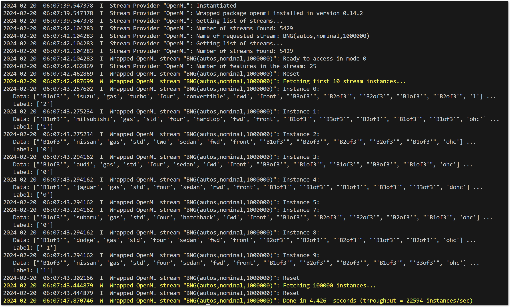

.. _Howto_BF_STREAMS_001:
Howto BF-STREAMS-001: Accessing Data Streams From OpenML
========================================================

**Executable code**

.. literalinclude:: ../../../../../test/howtos/bf/howto_bf_streams_001_accessing_data_from_openml.py
	:language: python

**Results**

**Cross Reference**
    - :ref:`API Reference: Streams <api_streams>`
